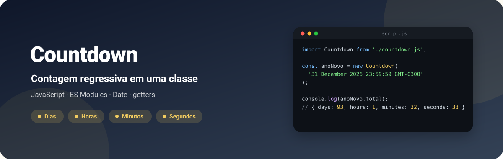
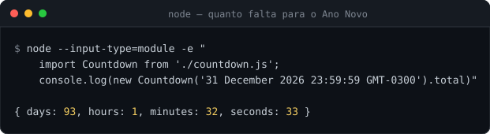
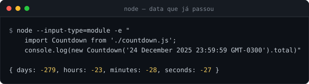

<div align="center">



**Plugin de contagem regressiva em ES Module: uma classe que recebe uma data e devolve quantos dias, horas, minutos e segundos faltam.**

[](https://github.com/kessleru/Countdown-Plugin/commits/main)
[](countdown.js)



</div>

## Sobre

Um estudo de **classes, getters e módulos** em JavaScript. Todo o plugin é um arquivo,
[`countdown.js`](countdown.js), sem dependências: a classe guarda a data futura e calcula tudo sob
demanda a partir da diferença entre ela e `new Date()`. Não há estado nem timer interno — cada
leitura de `.total` é uma conta nova, então quem decide a frequência de atualização é quem usa.

A saída acima é de uma execução real em 29/09/2026, por volta das 22h30 (GMT-3).

## Uso

1. Copie o [`countdown.js`](countdown.js) para o seu projeto.
2. Importe num script carregado como módulo:

   ```js
   import Countdown from './countdown.js';

   const natal = new Countdown('24 December 2026 23:59:59 GMT-0300');
   console.log(natal.total); // { days, hours, minutes, seconds }
   ```

   ```html
   <script type="module" src="script.js"></script>
   ```

3. Para atualizar a tela a cada segundo, leia `.total` dentro de um `setInterval`:

   ```js
   const dias = document.querySelector('[data-dias]');
   const horas = document.querySelector('[data-horas]');
   const minutos = document.querySelector('[data-minutos]');
   const segundos = document.querySelector('[data-segundos]');

   function atualizarTela() {
     const tempo = natal.total;
     dias.textContent = tempo.days;
     horas.textContent = tempo.hours;
     minutos.textContent = tempo.minutes;
     segundos.textContent = tempo.seconds;
   }

   atualizarTela();
   setInterval(atualizarTela, 1000);
   ```

## API

| Membro | Retorna |
|---|---|
| `new Countdown(data)` | Instância. `data` é qualquer string que `new Date()` entende |
| `.total` | `{ days, hours, minutes, seconds }`, com horas, minutos e segundos já no resto (0–23, 0–59) |
| `.days` | Dias inteiros restantes |
| `.hours` | Horas **totais** restantes (não o resto do dia) |
| `.minutes` | Minutos totais restantes |
| `.seconds` | Segundos totais restantes |

## Depois que a data passa

O plugin não trava em zero: a diferença fica negativa e os valores também.



Se o seu caso precisa parar em zero, confira `tempo.seconds < 0` antes de mostrar. É também por
isso que o [`script.js`](script.js) de exemplo do repositório, que usa datas de 2025, hoje imprime
números negativos no console.

## Rodando localmente

```bash
git clone https://github.com/kessleru/Countdown-Plugin.git
cd Countdown-Plugin
node --input-type=module -e "
  import Countdown from './countdown.js';
  console.log(new Countdown('31 December 2026 23:59:59 GMT-0300').total)"
```

No navegador, sirva a pasta (`python -m http.server 8000`) e abra o console em
`http://localhost:8000`: o [`script.js`](script.js) imprime o `.total` a cada segundo. Abrir o
`index.html` direto (`file://`) não funciona, porque o navegador bloqueia ES Modules fora de um
servidor.

## Estrutura

```
├── countdown.js   # o plugin: a classe Countdown
├── script.js      # exemplo de uso, com saída no console
└── index.html     # carrega o script.js como módulo
```

<details>
<summary><b>Regerando as imagens deste README</b></summary>

As imagens são SVG gerados por script a partir das saídas reais coladas em
[`.github/readme/gerar.mjs`](.github/readme/gerar.mjs):

```bash
node .github/readme/gerar.mjs
```

</details>

---

<div align="center">
<sub>Feito por <a href="https://github.com/kessleru">Otávio Kessler Ustra</a></sub>
</div>
